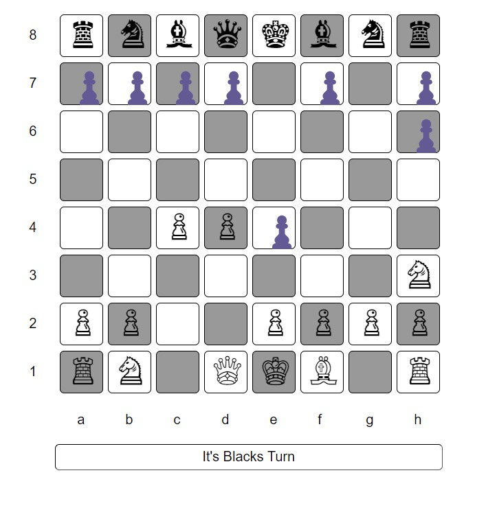

# 2-player-chess
A simple and interactive 2-player chess game built using **HTML**, **CSS**, and **JavaScript**. This game allows two players to play chess on the same device, taking turns to move pieces on a traditional chessboard.

---

## Features
- **2-Player Mode**: Two players can play locally on the same device.
- **Interactive Chessboard**: Click on pieces to move them.
- **Basic Chess Rules**: Implemented movements for all chess pieces.
- **Responsive Design**: Play the game on any screen size.

---

## Technologies Used
- **HTML**: Used for the structure and layout of the chessboard.
- **CSS**: Provides styling for the chessboard, pieces, and user interface.
- **JavaScript**: Used for the game logic, piece movement, and turn-based system.

---

## How to Play
1. Open the `index.html` file in your browser.
2. The game will load a standard chessboard.
3. Player 1 (White) and Player 2 (Black) take turns clicking on their pieces to move them.
4. The game follows the basic rules of chess, including castling, pawn promotion, and en passant.
5. The game ends when one player checkmates the other or if a stalemate occurs.

---

## Installation
1. Clone the repository:
   ```
   git clone https://github.com/your-username/2-player-chess-game.git
   ```
2. Navigate to the project directory:
   ```
   cd 2-player-chess-game
   ```
3. Open `index.html` in your web browser to start playing.

---

## Demo
You can view a live demo of the game [here](https://deevkapoor.github.io/2-player-chess/).

---

## Future Enhancements
- Add AI to play against the computer.
- Add time control (like chess clocks).
- Improve the graphics for chess pieces and the board.
- Add a feature to reset the game.

---

## Screenshots


---

## Contributing
Feel free to fork the repository and submit pull requests if you'd like to contribute.

1. Fork the project.
2. Create a new branch:
   ```
   git checkout -b feature-branch
   ```
3. Commit your changes:
   ```
   git commit -m 'Add new feature'
   ```
4. Push to the branch:
   ```
   git push origin feature-branch
   ```
5. Open a pull request.

---

## License
This project is licensed under the MIT License - see the [LICENSE](LICENSE) file for details.

---

## Contact
If you have any questions or suggestions, feel free to contact me:
- **Email**: deevanshukapoor010206@gmail.com
- **GitHub**: [DeevKapoor](https://github.com/DeevKapoor)

---

### Happy Playing! ♟️
